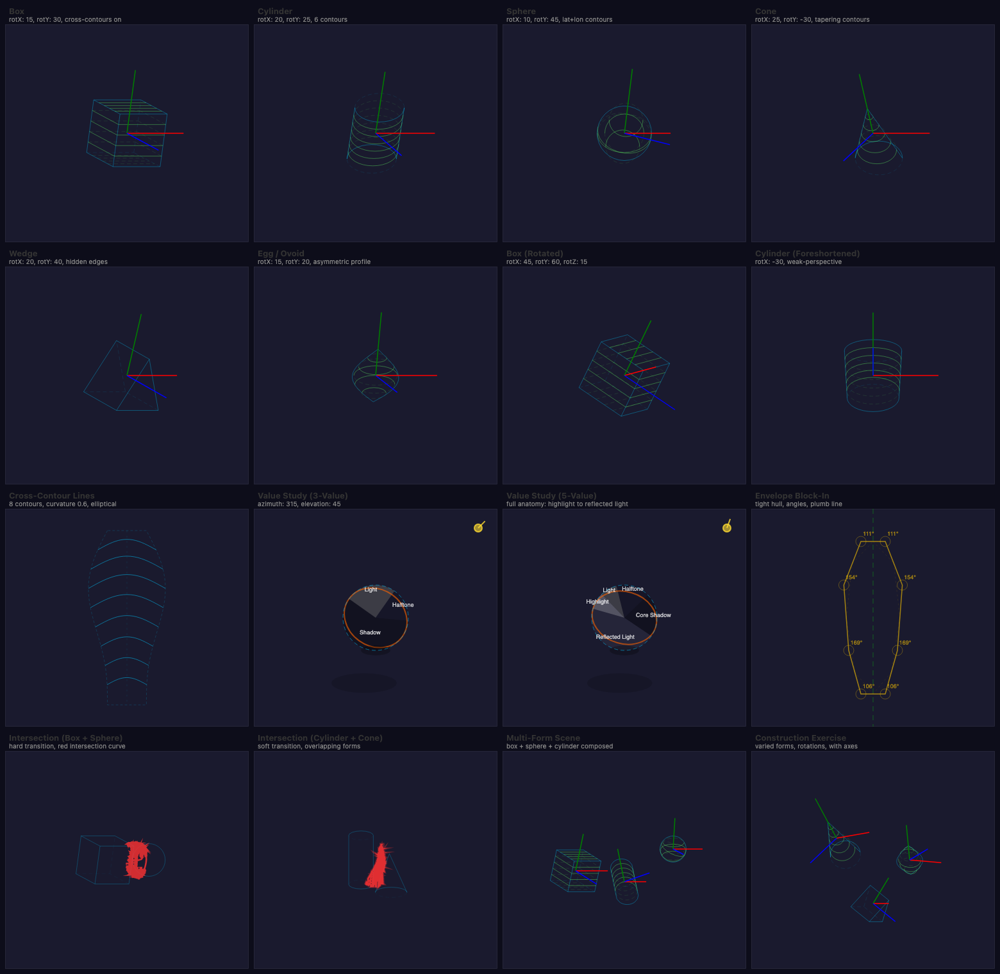

# @genart-dev/plugin-construction

Drawing construction guides plugin for [genart.dev](https://genart.dev) — 3D form primitives (box, cylinder, sphere, cone, wedge, egg), cross-contour lines, value/shadow studies, envelope block-ins, and form intersections. All layers are non-destructive guide overlays. Includes MCP tools for AI-agent control.

Part of [genart.dev](https://genart.dev) — a generative art platform with an MCP server, desktop app, and IDE extensions.

## Examples



Source file: [construction-guides.genart](test-renders/construction-guides.genart)

## Install

```bash
npm install @genart-dev/plugin-construction
```

## Usage

```typescript
import constructionPlugin from "@genart-dev/plugin-construction";
import { createDefaultRegistry } from "@genart-dev/core";

const registry = createDefaultRegistry();
registry.registerPlugin(constructionPlugin);

// Or access individual layer types and math utilities
import {
  formLayerType,
  crossContourLayerType,
  valueShapesLayerType,
  envelopeLayerType,
  intersectionLayerType,
  constructionMcpTools,
  rotationMatrix,
  projectedEllipse,
  lightDirection,
  computeEnvelope,
  approximateIntersection,
} from "@genart-dev/plugin-construction";
```

## Layer Types (5)

### Common Guide Properties

Shared by all five layer types:

| Property | Type | Default | Description |
|----------|------|---------|-------------|
| `guideColor` | color | `"rgba(0,200,255,0.5)"` | Guide line color |
| `lineWidth` | number | `1` | Line width in pixels (0.5-5) |
| `dashPattern` | string | `"6,4"` | CSS dash pattern |

### Construction Form (`construction:form`, guide)

3D form primitive with Euler rotation, projection, cross-contours, and hidden-edge rendering. Supports 6 form types: box, cylinder, sphere, cone, wedge, and egg/ovoid.

| Property | Type | Default | Description |
|----------|------|---------|-------------|
| `formType` | select | `"box"` | box / cylinder / sphere / cone / wedge / egg |
| `position` | point | `{x:0.5, y:0.5}` | Normalized position (0-1) |
| `formSize` | number | `0.25` | Overall size (0.05-0.6) |
| `sizeX` | number | `1.0` | Width scale (0.2-3.0) |
| `sizeY` | number | `1.0` | Height scale (0.2-3.0) |
| `sizeZ` | number | `1.0` | Depth scale (0.2-3.0) |
| `rotationX` | number | `15` | X rotation in degrees (-90 to 90) |
| `rotationY` | number | `30` | Y rotation in degrees (-180 to 180) |
| `rotationZ` | number | `0` | Z rotation in degrees (-180 to 180) |
| `projection` | select | `"orthographic"` | orthographic / weak-perspective |
| `showCrossContours` | boolean | `true` | Show cross-contour lines |
| `crossContourCount` | number | `5` | Number of cross-contour lines (1-12) |
| `showAxes` | boolean | `true` | Show XYZ axes |
| `axisLength` | number | `1.2` | Axis length multiplier (0.5-2.0) |
| `showHiddenEdges` | boolean | `true` | Show hidden edges |
| `hiddenEdgeStyle` | select | `"dashed"` | dashed / dotted / faint / hidden |
| `hiddenEdgeAlpha` | number | `0.3` | Hidden edge opacity (0-0.8) |
| `edgeColor` | color | `"rgba(0,200,255,0.7)"` | Edge line color |
| `contourColor` | color | `"rgba(100,255,100,0.5)"` | Cross-contour color |
| `axisColors` | string | `"red,green,blue"` | Axis colors (X,Y,Z comma-separated) |

### Cross-Contour Lines (`construction:cross-contour`, guide)

Draws cross-contour lines over an arbitrary outline and axis path, revealing surface curvature on any organic shape.

| Property | Type | Default | Description |
|----------|------|---------|-------------|
| `outline` | string | `"[]"` | Outline points JSON (normalized 0-1) |
| `axis` | string | `"[]"` | Central axis path JSON (normalized 0-1) |
| `contourCount` | number | `8` | Number of contour lines (2-20) |
| `curvature` | number | `0.5` | Curvature (0=flat, 0.5=cylindrical, 1=spherical) |
| `curvatureVariation` | string | `"[]"` | Per-contour curvature overrides JSON |
| `contourStyle` | select | `"elliptical"` | elliptical / angular / organic |
| `showAxis` | boolean | `true` | Show central axis |
| `showOutline` | boolean | `true` | Show outline |
| `wrapDirection` | select | `"perpendicular"` | perpendicular / custom |
| `contourSpacing` | select | `"even"` | even / perspective |

### Value Shapes Study (`construction:value-shapes`, guide)

Light/shadow value study overlay with terminator, cast shadow, occlusion shadow, and configurable value zones.

| Property | Type | Default | Description |
|----------|------|---------|-------------|
| `formData` | string | `"[]"` | Form definitions JSON |
| `lightAzimuth` | number | `315` | Light direction 0-360 degrees |
| `lightElevation` | number | `45` | Light elevation 10-80 degrees |
| `lightIntensity` | number | `0.8` | Light intensity (0.1-1.0) |
| `showLightIndicator` | boolean | `true` | Show light direction indicator |
| `valueGrouping` | select | `"three-value"` | two-value / three-value / five-value |
| `shadowColor` | color | `"rgba(0,0,0,0.3)"` | Shadow zone color |
| `lightColor` | color | `"rgba(255,255,200,0.15)"` | Light zone color |
| `halftoneColor` | color | `"rgba(0,0,0,0.12)"` | Halftone zone color |
| `highlightColor` | color | `"rgba(255,255,255,0.25)"` | Highlight zone color |
| `reflectedLightColor` | color | `"rgba(100,100,120,0.15)"` | Reflected light color |
| `showTerminator` | boolean | `true` | Show terminator line |
| `terminatorWidth` | number | `2` | Terminator line width (1-5) |
| `showCastShadow` | boolean | `true` | Show cast shadow |
| `showOcclusionShadow` | boolean | `true` | Show occlusion shadow |
| `showZoneLabels` | boolean | `false` | Show value zone labels |
| `groundPlaneY` | number | `0.8` | Ground plane Y position (0-1) |

### Envelope Block-In (`construction:envelope`, guide)

Straight-line envelope (convex hull or fitted polygon) with angle annotations, plumb/level lines, comparative measurements, and recursive subdivisions.

| Property | Type | Default | Description |
|----------|------|---------|-------------|
| `envelopePath` | string | `"[]"` | Envelope vertex points JSON (normalized 0-1) |
| `envelopeStyle` | select | `"tight"` | tight (convex hull) / loose (expanded) / fitted (as given) |
| `showAngles` | boolean | `true` | Show angle annotations |
| `angleThreshold` | number | `10` | Min angle deviation to annotate (5-45) |
| `showPlumbLine` | boolean | `true` | Show vertical plumb line |
| `plumbLinePoint` | point | `{x:0.5, y:0}` | Plumb line reference point |
| `showLevelLines` | boolean | `false` | Show horizontal level lines |
| `levelLinePoints` | string | `"[]"` | Level line Y positions JSON |
| `showMeasurements` | boolean | `false` | Show comparative measurements |
| `measurementPairs` | string | `"[]"` | Measurement segment pairs JSON |
| `showSubdivisions` | boolean | `false` | Show midpoint subdivisions |
| `subdivisionDepth` | number | `1` | Subdivision recursion depth (0-3) |
| `envelopeColor` | color | `"rgba(255,200,0,0.6)"` | Envelope line color |
| `plumbColor` | color | `"rgba(0,255,0,0.4)"` | Plumb/level line color |
| `measureColor` | color | `"rgba(255,100,100,0.5)"` | Measurement color |

### Form Intersection (`construction:intersection`, guide)

Intersection lines between two or more overlapping 3D forms, computed by surface sampling.

| Property | Type | Default | Description |
|----------|------|---------|-------------|
| `forms` | string | `"[]"` | Form definitions JSON (min 2) |
| `showForms` | boolean | `true` | Render the forms |
| `showIntersectionLines` | boolean | `true` | Show intersection curves |
| `intersectionWidth` | number | `2.5` | Intersection line width (1-6) |
| `intersectionColor` | color | `"rgba(255,50,50,0.8)"` | Intersection line color |
| `intersectionStyle` | select | `"solid"` | solid / bold / emphasized |
| `showFormLabels` | boolean | `false` | Show A/B/C labels |
| `transitionType` | select | `"hard"` | hard / soft / mixed |

## MCP Tools (8)

| Tool | Description |
|------|-------------|
| `add_construction_form` | Add a 3D construction form guide layer (box, cylinder, sphere, cone, wedge, egg) |
| `add_construction_scene` | Add multiple 3D construction forms arranged as a scene |
| `add_cross_contours` | Add cross-contour lines over an outline + axis path |
| `add_value_study` | Add a light/shadow value study overlay with terminator and value zones |
| `add_envelope` | Add a straight-line envelope block-in with angle and measurement annotations |
| `add_form_intersection` | Add intersection lines between two or more overlapping 3D forms |
| `generate_construction_exercise` | Generate a random construction exercise with forms at varying difficulty |
| `clear_construction_guides` | Remove all `construction:*` layers from the layer stack |

## Math Overview

### Euler Rotation

Forms are rotated using ZYX Euler angles: **R = Rz * Ry * Rx**. The X rotation is clamped to [-90, 90] to avoid gimbal lock. The 3x3 rotation matrix transforms vertices, normals, and light directions in a single multiply.

### Ellipse Projection

A 3D circle viewed at an angle projects to an ellipse. The minor axis equals `radius * |cos(tilt)|` where tilt is the angle between the circle's normal and the view direction. This drives cross-contour rendering on cylinders, cones, spheres, and eggs — each form generates ellipses at regular intervals along its axis.

### Shadow Anatomy

Light is defined by azimuth (0-360) and elevation (10-80) which convert to a 3D direction vector. On a sphere:
- **Terminator**: great circle perpendicular to the light direction, rendered as a projected ellipse
- **Value zones**: the sphere surface is divided into highlight, light, halftone, core shadow, and reflected light regions based on the angle between the surface normal and light direction
- **Cast shadow**: projected onto the ground plane using `shadowLength = radius / tan(elevation)`

### Envelope Geometry

Envelopes use Andrew's monotone chain convex hull algorithm. Angle annotations compute the interior angle at each vertex using the dot product of adjacent edge vectors. Plumb lines (vertical) and level lines (horizontal) provide alignment references. Comparative measurements report ratios between segment pairs.

### Form Intersection

Intersection curves between two forms are approximated by sampling both surfaces in 3D, finding pairs of surface points within a distance threshold, and connecting the midpoints into a curve ordered by nearest-neighbor traversal.

## Exported API

### Layer Types
- `formLayerType` — Construction form (box/cylinder/sphere/cone/wedge/egg)
- `crossContourLayerType` — Cross-contour lines on arbitrary outlines
- `valueShapesLayerType` — Value/shadow study overlay
- `envelopeLayerType` — Envelope block-in with annotations
- `intersectionLayerType` — Form intersection lines
- `constructionMcpTools` — Array of all 8 MCP tool definitions

### Rotation Math (`math/rotation`)
- `rotationMatrix(rxDeg, ryDeg, rzDeg)` — Build ZYX Euler rotation matrix
- `rotate3D(point, matrix)` — Transform Vec3 by Mat3
- `project(point, projection, focalLength)` — Project 3D to 2D
- `transformPoint(point, rx, ry, rz, projection, focalLength)` — Rotate + project in one call
- `transformedNormalZ(normal, matrix)` — Z component of transformed normal (face visibility)
- `identityMatrix()`, `multiplyMat3(a, b)` — Matrix utilities
- `normalize3(v)`, `dot3(a, b)`, `cross3(a, b)` — Vector operations
- `clamp(v, min, max)` — Numeric clamp

### Ellipse Math (`math/ellipse`)
- `projectedEllipse(center, radius, normalTilt, axisRotation)` — Circle-to-ellipse projection
- `drawEllipse(ctx, cx, cy, rx, ry, rotation)` — Draw ellipse arc
- `drawEllipseWithHidden(ctx, params, frontHalf, hiddenAlpha, hiddenDash)` — Draw with visible/hidden split
- `ellipsePoints(params, segments)` — Sample points along ellipse

### Shadow Math (`math/shadow`)
- `lightDirection(light)` — 3D light direction from azimuth + elevation
- `lightDirection2D(light)` — 2D light indicator direction
- `sphereTerminator(center, radius, light, matrix)` — Terminator ellipse on sphere
- `castShadow(center, radius, light, groundY)` — Cast shadow polygon
- `sphereValueZones(center, radius, light, matrix, grouping)` — Value zone paths

### Envelope Math (`math/envelope`)
- `computeEnvelope(points, style)` — Convex hull / expanded / fitted envelope
- `envelopeAngles(vertices)` — Interior angles at each vertex
- `plumbLine(referencePoint, bounds)` — Vertical reference line
- `levelLine(referencePoint, bounds)` — Horizontal reference line
- `comparativeMeasure(segment1, segment2)` — Segment length ratio

### Intersection Math (`math/intersection`)
- `approximateIntersection(form1, form2, samples)` — Intersection curve between two forms

## Related Packages

| Package | Purpose |
|---------|---------|
| [`@genart-dev/core`](https://github.com/genart-dev/core) | Plugin host, layer system (dependency) |
| [`@genart-dev/plugin-perspective`](https://github.com/genart-dev/plugin-perspective) | Perspective grids and floor planes |
| [`@genart-dev/plugin-layout-guides`](https://github.com/genart-dev/plugin-layout-guides) | Composition guides (rule of thirds, golden ratio, grid) |
| [`@genart-dev/mcp-server`](https://github.com/genart-dev/mcp-server) | MCP server that surfaces plugin tools to AI agents |

## Support

Questions, bugs, or feedback — [support@genart.dev](mailto:support@genart.dev) or [open an issue](https://github.com/genart-dev/plugin-construction/issues).

## License

MIT
